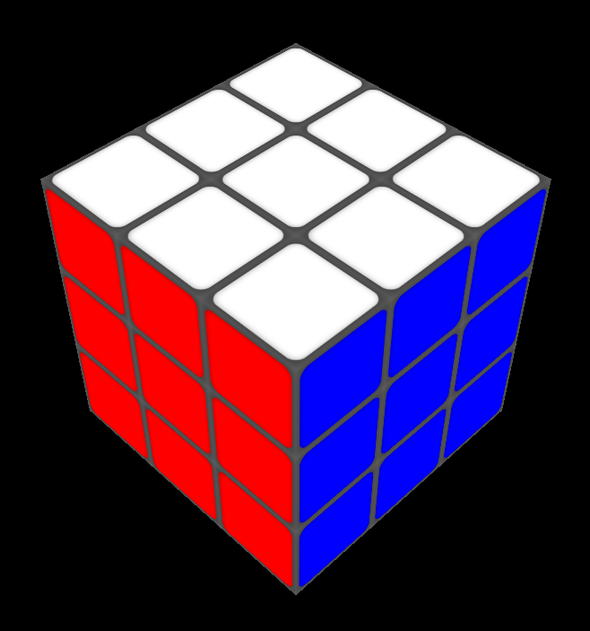

# Rubik's Cube

This is Rubik's Cube made mainly with 3-dimensional CSS transforms and a bit of JavaScript to execute them. No WebGL or libraries such as Three.js are used.

https://rubikcubecss.netlify.app

  
Open the menu with the `i` key to see all the keys for rotating the cube and its layers.

When many rotations are entered quickly in a row, a queue executes them one by one. There are also options to undo moves, scramble the cube, reset the cube, zoom, or make the cube transparent. When the cube is solved, an animation is started.
